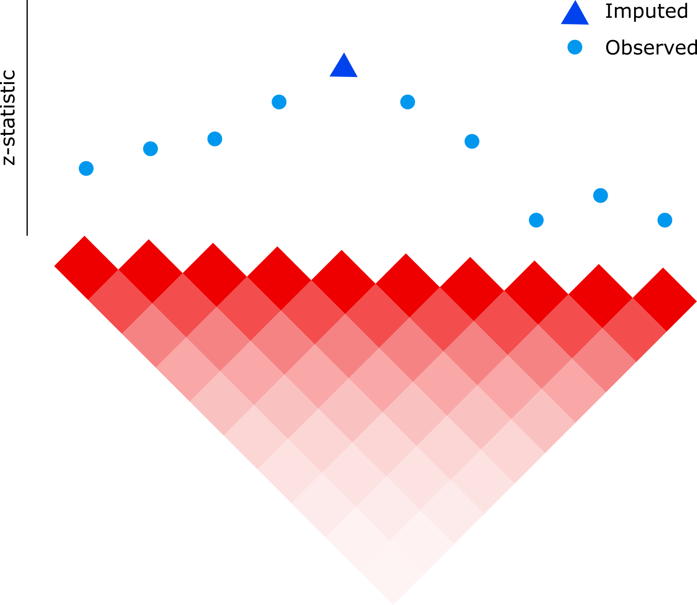

<br>

## Impute z-statistics for missing variants using observed z-statistics and LD matrix

<br>
<div align='center'>

</div>

<div style="text-align: justify">
Genome-wide association studies (GWAS) performs tests of association across millions of genetic variants.  The `imputez` package provides a series of statistical methods to impute the z-statistic for missing genetic variants by using LD information from a reference panel.  The package achieves high accuracy by regularizing the LD matrix and uses a probabilistic whitening transformation with implicit covariance to scale to high-dimensional datasets.  While standard analysis is $\mathcal{O}(p^3)$ in the number of features, $p$, the package implements an algorithm that is the minimum of $\mathcal{O}(n p^2)$ and $\mathcal{O}(n^2 p)$.  For large number of features, this is can be a dramatic speedup.


### Methods 
- `imputezDecorr()`: scalable imputation using probabilistic whitening transformation with implicit covariance as implemented in the [decorrelate](https://gabrielhoffman.github.io/decorrelate/) package.
- `imputez()`: standard method for comparison that is cubic time in $p$


</div>


### Installation
```r
devtools::install_github("GabrielHoffman/imputez")
```
